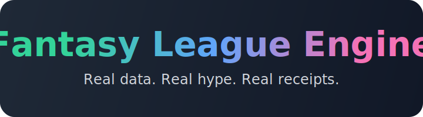

<p align="center">
  
</p>

<p align="center">
  <a href="#backend-quickstart">Backend Quickstart</a>
  · <a href="#architecture-overview">Architecture</a>
  · <a href="#data-artifacts">Data Artifacts</a>
  · <a href="#frontend-snapshot">Frontend Snapshot</a>
  · <a href="#testing--quality">Testing</a>
  · <a href="#license">License</a>
</p>

<h1 align="center">Fantasy League Engine</h1>

<p align="center">
  <a href="https://www.python.org/downloads/"></a>
  <a href="https://nodejs.org/en/download"></a>
  <a href="LICENSE"></a>
  <a href="docs/frontend-ux-data-contract.md"></a>
</p>

<p align="center">
  Data pipeline + live frontend that turns decade-long fantasy leagues into a shareable hype engine—always driven by real ESPN/nflverse feeds.
</p>

---

## Highlights

- **Deterministic backend** – Python CLI ingests ESPN private leagues, normalizes snapshots, enriches with nflverse stats, and writes reproducible CSV/JSON outputs.
- **Custom scoring engine** – league-specific scoring (bonuses, position modifiers, two-point conversions) applied directly to weekly datasets.
- **Rest-of-season simulator** – Monte Carlo engine produces playoff odds, seed distributions, and matchup projections for every remaining week.
- **Real-data frontend** – Next.js App Router dashboard renders the simulator grid and APIs straight from the generated artifacts (no mocks).

---

## Architecture Overview

| Layer | Responsibilities | Status |
|-------|------------------|--------|
| Backend (Python CLI) | Authenticated ESPN pulls, nflverse sync, normalization, scoring, simulation export | ✅ Active
| Data Artifacts | CSV/JSON outputs under `data/out/` and `data/out/simulations/` | ✅ Active
| Frontend (Next.js) | Rest-of-season simulator grid and APIs backed by real artifacts | ✅ Active (first release)
| Docs | UX architecture & data contracts, future contribution guides | ✅ `docs/`

---

## Project Structure

```
.
├── apps/
│   └── web/               # Next.js App Router frontend (initial scaffold)
├── config/                # Scoring configs and env templates
├── data/raw/              # Cached source pulls (gitignored)
├── data/in/               # Intermediate baselines (gitignored)
├── data/out/              # Generated outputs (gitignored)
├── docs/                  # UX notes, data contracts, assets
├── src/fantasy_nfl/       # Python package source
├── tests/                 # Test scaffolding
└── README.md
```

---

## Backend Quickstart

1. **Prerequisites**
   ```bash
   curl -sSL https://install.python-poetry.org | python3 -    # install Poetry once
   ```
2. **Install dependencies**
   ```bash
   poetry install
   ```
3. **Configure environment**
   ```bash
   cp .env.example .env
   # add ESPN credentials or cookies
   ```
4. **Inspect configuration**
   ```bash
   poetry run fantasy env
   ```
5. **Capture ESPN cookies**
   ```bash
   poetry run fantasy auth login          # or --browser / --show-browser if automation fails
   ```
6. **Pull & normalize league data**
   ```bash
   poetry run fantasy espn pull           # base views
   poetry run fantasy espn normalize      # writes teams/roster/schedule CSVs
   ```
7. **Sync nflverse stats**
   ```bash
   poetry run fantasy nflverse pull --season 2024
   ```
8. **Build weekly datasets + scoring**
   ```bash
   poetry run fantasy espn build-week --season 2024 --week 1
   poetry run fantasy score week --season 2024 --week 1
   ```
   Outputs land under `data/out/espn/<season>/` (e.g., `roster_enriched.csv`, `weekly_scores_*.csv`).
9. **Or run the all-in-one refresh**
   ```bash
   poetry run fantasy refresh-all --season 2025 --week 1
   ```
   Add `--start-week/--end-week` to cover a span, `--force-nflverse` for fresh downloads, or `--skip-score` to stop before scoring. A convenience `npm run refresh-all` script proxies the same command.

---

## Data Artifacts

- `data/out/espn/<season>/teams.csv` – core team metadata (owners, logos, seeds).
- `data/out/espn/<season>/roster.csv` & `roster_enriched.csv` – active roster slots merged with nflverse IDs.
- `data/out/espn/<season>/schedule.csv` – matchup matrix with results and opponent mapping.
- `data/out/espn/<season>/weekly_stats_*.csv` – per-player stat lines joined to lineup slots.
- `data/out/espn/<season>/weekly_scores_*.csv` – scoring-engine output with base/bonus breakdowns.
- `data/out/simulations/<season>/rest_of_season.json` – rest-of-season simulator bundle (matchups, standings projections, Monte Carlo odds).
- Planned extensions: highlights, insights, asset manifests (see `docs/frontend-ux-data-contract.md`).
- API routes: `GET /api/league` for team metadata and `GET /api/sim/rest-of-season` for the latest simulator dataset (returns 503 until artifacts exist).

---

## Frontend Snapshot

- Next.js App Router workspace lives at `apps/web/`.
- The `/` page renders the rest-of-season simulator grid, driven by the backend JSON (`/api/sim/rest-of-season`).
- Additional surfaces (matchup narratives, transaction timelines, projection overrides) will build on the same artifact contracts.

---

## Documentation & Guides

- **UX & Data Contract** → `docs/frontend-ux-data-contract.md`
- **Scoring configuration** → `config/scoring.yaml`
- Additional guides (frontend tooling, contribution flow) will land here as those components commit.

---

## Testing & Quality

- Run backend tests:
  ```bash
  poetry run pytest
  ```
- Linting/formatting hooks will be introduced as the codebase grows.
- Frontend testing strategy will be documented once the Next.js workspace is active.

---

## License

Distributed under the [MIT License](LICENSE).
